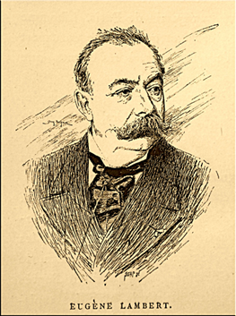
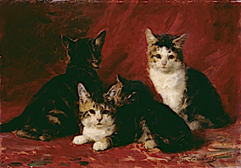

Cette notice est le fruit d'un entretien avec Brigitte Diaz. Propos recueillis par Irène Gimenez et Sara Legrandjacques.

.](Picture1.png)

## Eugène Lambert, un peintre dans la toile épistolaire de George Sand

Entre 1852 et son décès en 1876, George Sand, femme de lettres, née sous le nom d’Aurore Dupin en 1804, adresse environ 155 courriers au peintre Eugène Lambert (1825-1900) (Ill. 2a et 2b). 

, Paris.](sand.jpg)

Cette figure de la peinture du Second Empire puis de la Troisième République s’est formée dans le Paris des années 1840. Issu d’un milieu modeste – son père était horticulteur – et très tôt orphelin de mère, il fréquente à partir de 1842 l’atelier d’Eugène Delacroix aux côtés de Maurice Sand (1823-1889), fils de George, elle-même amie de Delacroix.

À partir de 1844, Lambert rejoint le domaine de Nohant, dans le Berry, où vit George Sand entourée de ses proches. Il ne tarda pas à y être traité comme un membre de la famille et, comme tous les amis du cercle rapproché de Sand, il fut vite affublé de surnoms : « Tortillard » et « Lambrouche ». Il demeure à Nohant une douzaine d’années et devient un membre précieux du théâtre domestique, situé dans la maison de Sand. Les premières lettres, à partir de 1848, témoignent de l’intimité qui s’est instaurée entre l’écrivaine et le peintre, qui échangent lors des courts séjours à Paris d’Eugène Lambert. Il y retourne définitivement en 1856.

En 1862, le mariage d’Eugène Lambert avec Victorine-Esther Gaitet (1831-18??) lui permet d’intégrer le milieu de la bourgeoisie parisienne tout en faisant d’Esther une destinatrice complémentaire des courriers de George Sand. Si rares sont les lettres destinées exclusivement à l’épouse de celui que l’on nomme alors le « Raphaël des Chats » (Ill.3), nombre d’entre elles s’adressent au couple lui-même, affectueusement surnommé « les Lambrouche ».

Toutefois, c’est la seconde épouse de Lambert, Rose Julie Marie Mathilde Valentine Estienne (1848-1932) qui fait don à l’Université de Paris, de manière posthume en 1938, de 151 de ces lettres reçues par son défunt époux de la part de George Sand. Elles intègrent d’abord la bibliothèque de l’Institut de langue et littérature françaises de la Sorbonne jusqu’à la création de la bibliothèque Georges Ascoli en 1971. À partir de 2022, elles ont été inventoriées, numérisées et mises en ligne sur la bibliothèque numérique de Sorbonne Université – SorbonNum. Les lettres de Lambert à Sand sont quant à eux conservés à la Bibliothèque historique de la Ville de Paris.

La centaine de lettres n’a rien d’exceptionnel et s’inscrit plutôt dans la vaste correspondance de George Sand, compilée et publiée entre 1966 et 1995 par l’éditeur Georges Lubin. Celui-ci n’a découvert qu’en 1982 cet ensemble de lettres conservés dans le fonds Sand-Lambert. Il en est alors au tome 17 de son édition intégrale en 26 volumes : ce n’est que dans ce tome qu’il commence à insérer les lettres de Sand à Lambert, avec celle du 15 mai 1862 dans laquelle l’écrivaine invite le peintre au mariage de son fils Maurice avec Lina. Toutes les lettres qui précèdent cette date sont publiées dans le volume 25 de la *Correspondance*.

## Vivre puis écrire depuis Nohant : arts et sociabilités

Si les activités épistolaires ont une place importante dans la vie de l’écrivaine berrichonne, les lettres aux Lambert témoignent d’une relation privilégiée, tant filiale qu’artistique, entre Sand et Lambert, et relient Nohant, situé à une trentaine de kilomètres de Châteauroux, dans l’Indre, et Paris. Le lien épistolaire n’a rien d’exclusif mais n’en témoigne pas moins des différentes phases des vies entremêlées des deux correspondants.

En s’installant au domaine de Nohant en 1842, Eugène Lambert intègre le cercle familial de Sand, personnalité littéraire majeure à laquelle il s’adresse toujours avec une grande déférence. Celle-ci a récupéré la propriété à la suite de sa séparation avec Casimir Dudevant (1795-1871) officialisée en 1836. Nohant ne tarde pas à devenir le lieu de rendez-vous de nombreux artistes qui ont fait le romantisme, comme le compositeur Franz Liszt (1811-1886), la femme de lettres Marie d’Agoult (1805-1875) ou encore le peintre Eugène Delacroix (1798-1863). 

C’est sans doute un Nohant plus familial, où va notamment résider le pianiste polonais Frédéric Chopin (1810-1849), que rejoint le jeune Eugène Lambert. Le domaine n’en est pas moins marqué, à partir de l’été 1849, par des activités artistiques, autour du théâtre. Alors que de nombreux comédiens viennent de Paris et se joignent à l’équipe des Berrichons, Lambert participe à l’élaboration des décors et à la mise en scène, dessine des costumes et monte sur scène, se distinguant dans des rôles comiques. En 1853, il participe à l’adaptation du roman Mauprat en réalisant les maquettes et costumes pour les représentations données au théâtre parisien de l’Odéon. La proximité de Lambert avec George Sand transparaît déjà : celle-ci lui dédicace son ouvrage Les Maîtres Sonneurs paru le 17 avril 1853 (Ill. 4).

](lettre28fev53.png)

Lambert renaît à Nohant auprès de Sand qui tient le rôle de mère d’adoption et de mentor. Toutefois, la relation des deux artistes entame une nouvelle phase en 1862, consécutive de l’installation parisienne du peintre et de son mariage avec Esther. Si Sand se plaint du départ de son protégé et cherche à contrôler ses fréquentations, la proximité demeure réelle jusqu’à la mort de l’écrivaine. Elle se rend régulièrement à Paris et achète en 1864 une maison à Palaiseau, à quelques kilomètres au sud-ouest de la capitale. En septembre 1865, après la mort d’Alexandre Manceau (1817-1865), son compagnon avec qui elle résidait à Palaiseau, Sand exprime son désir de se rapprocher des époux Lambert installés 70 rue Notre Dame des Champs, à proximité du jardin du Luxembourg (Ill. 5). Le projet reste inabouti mais George Sand n’hésite pas à recevoir directement chez le couple, comme c’est le cas en mars 1866 avec la comédienne Jeanne Arnould-Plessis.

.](lettre18sept65.png)

## Marrainage artistique et maternité sociale : la correspondance, un outil pour l’histoire familiale de Sand

La relation entre les épistoliers est marquée par une profonde déférence, du côté d’Eugène Lambert qui appelle Sand « chère madame » et la vouvoie tandis qu’elle s’adresse à lui en l’appelant « mon enfant », « mon cher petit », ou parfois tendrement « tortillard » et le tutoie. Cette correspondance nous renseigne sur l’histoire des émotions et du sentiment maternel. En effet, George Sand montre dans les lettres à Eugène Lambert une manière d’être mère qui se distingue des normes imposées aux femmes dans le cadre de la conjugalité ordinaire et de la famille réglée par le Code civil de 1804. On retrouve dans ses romans des relations mère/enfants non conventionnelles, par exemple dans *François le champi* (1848). En retour, le couple Lambert est très présent auprès d’elle lors des moments de maladie ou lors de la mort de son compagnon Alexandre Manceau en 1865.

Le sentiment maternel ne se limite pas, pour George Sand, à la maternité biologique. En tant que cheffe de famille, elle prend en charge matériellement le quotidien de ses enfants et leurs dépenses à Paris. Outre l’attachement filial qu’elle lui porte, Sand apprécie aussi la serviabilité de Lambert, qui fait un peu office d’homme de confiance et à qui elle délègue courses et visites professionnelles quand il est à Paris et elle à Nohant. 

Sand veille à guider la carrière de ses enfants et à les introduire dans les milieux importants pour eux. Tour à tour dans les correspondances avec Eugène Lambert, elle se positionne comme figure dispensant de l’affection et comme mentor et guide spirituel. De nombreuses lettres portent ainsi sur l’éducation artistique, mais aussi sentimentale, du jeune Lambert récemment arrivé à Paris (Ill. 6). 

](Picture2.jpg)

Elle dispense ainsi des conseils d’assiduité dans le travail, des directives, des incitations à la persévérance et des mises en garde, en se montrant même parfois un peu intrusive dans sa vie privée et amoureuse, notamment dans sa relation avec Amalia Ferrand : Sand dépeint la comédienne en femme dangereuse qui risquerait de l’éloigner de son art. 

Elle cherche également à l’encourager et, plus tard, une fois Lambert devenu un peintre reconnu, à lui faciliter l’obtention de la Légion d’honneur. Elle contacte à ce propos de nombreuses personnalités dont le ministre de l’Éducation Jules Simon (1814-1896). Il est finalement décoré en 1874 et est heureux de montrer à Sand, à cette occasion, qu’il n’est « pas un fruit sec » (lettre du 4 juillet 1873). Certaines lettres montrent que Sand le reconnaît progressivement comme un égal et s’adresse à lui d’artiste à artiste. Les lettres qu’elle lui adresse depuis Florence et Rome au printemps 1855 contiennent des descriptions fouillées avec une écriture travaillée qui vise à suggérer une atmosphère au peintre. 

La relation avec les Lambert est aussi un lieu où s’exprime le rêve communautaire de Sand. Elle exprime son désir de se rapprocher d’eux, voire d’habiter à leurs côtés, après la mort de son compagnon. Ils sont présents dans les lettres qu’elle adresse à d’autres au sujet de sa vie sociale et familiale. Leurs styles de vie marqués, après le mariage de Lambert, par l’aisance financière, les sociabilités artistiques et un rejet de la bourgeoisie, les rapprochent. Cette correspondance est donc aussi une plongée dans l’histoire de la vie privée des artistes sous le Second Empire et les débuts de la Troisième République. 

## Bibliographie

Sand, George, *Correspondance 1812-1876*. Textes réunis, classés et annotés par Georges Lubin, Paris, Éditions Garnier, 1964-1991, 25 vol. Un volume d’Index. 

Sand, George, *Œuvres autobiographiques*, Georges Lubin éd., Gallimard, « Bibliothèque de la Pléiade », 2 vol., 1971, 1972.

Diaz, Brigitte, *L’Épistolaire ou la pensée nomade*, puf, 2002.

Diaz, José-Luis, *« Moi qui ai vécu tant de vies » George Sand en ses métamorphoses*, Champ Vallon, 2026. 

Perrrot, Michelle, *George Sand à Nohant*, Éditions du Seuil, La Librairie du XXIe siècle, 2018.
